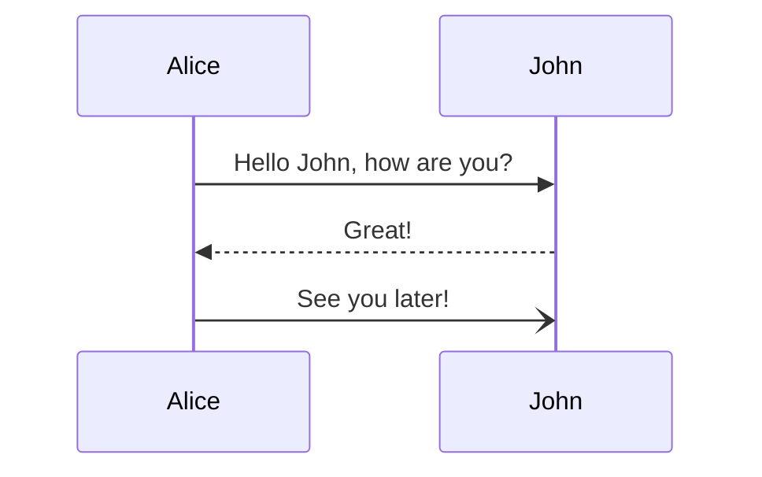
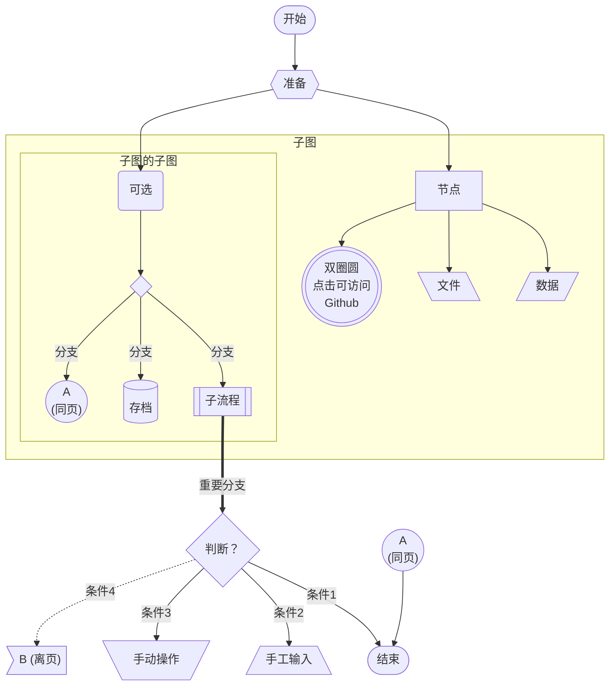

## 一、准备阶段

### 环境准备

```mermaid
sequenceDiagram
    Alice->>John: Hello John, how are you?
    John-->>Alice: Great!
    Alice-)John: See you later!

```

``` mermaid
flowchart TB
%% 图的方向说明
%% LR：从左到图，RL：从右到左，TB：从上到下，BT：从下到上

%% 连续连接
START([开始]) --> pre1{{准备}} --> node2[节点]
pre1 --> node1(可选)

subgraph 子图
subgraph 子图的子图
%% 一对多
node1 --> join1{ }
 join1 --> |分支|groud1[[子流程]] & database[(存档)] & inpage1(("A<br>(同页)"))
 %% click clickable "#Mermaid 的状态机图"
end     
node2 --> data1[/数据/]
node2 --> data2[\文件\]
node2 --> data3(((双圈圆<br>点击可访问<br>Github)))
click data3 "https://www.github.com" _blank
end

%% this is a comment

groud1 ==> |重要分支|cond1{"判断？"}
cond1 --> |条件1|END
cond1 --> |条件2|B[/手工输入\]
cond1 --> |条件3|B2[\手动操作/]
cond1 -.-> |条件4|outpage2>"B (离页)"]

inpage2(("A<br>(同页)")) --> END
END([结束])
```
